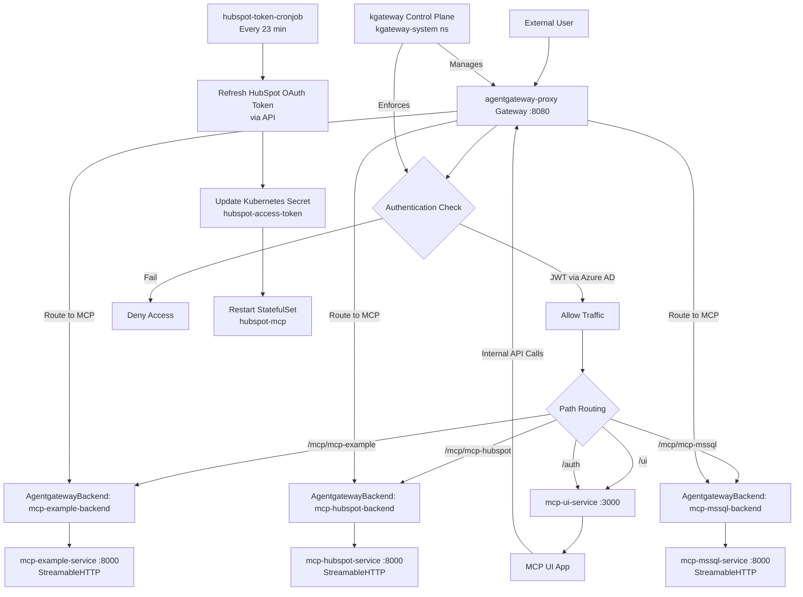

# Agent Gateway MCP Architecture Flow

## Overview

The Agent Gateway MCP architecture is a Kubernetes-based system that provides a unified entry point for Model Context Protocol (MCP) servers, featuring authentication, routing, and a web UI for interaction. It leverages the Gateway API for traffic management and supports multiple MCP servers (e.g., example, HubSpot, MSSQL) with scheduled token refresh via cronjobs.

## Key Components

- **Control Plane**: The kgateway control plane (deployed via Helm in `kgateway-system` namespace) manages the gateway infrastructure and enforces policies.
- **Proxy/Gateway**: The `agentgateway-proxy` Gateway listens on port 8080 and routes HTTP traffic based on path prefixes.
- **Authentication**: Azure AD JWT authentication policy applied to the gateway for secure access.
- **MCP Servers**: Individual deployments (e.g., `mcp-example`, `mcp-hubspot`, `mcp-mssql`) expose MCP protocol endpoints via `AgentgatewayBackend` resources using StreamableHTTP.
- **UI**: The `mcp-ui` application provides a web interface for interacting with MCP servers, accessible at `/ui`.
- **Cronjob**: The `hubspot-token-cronjob` periodically refreshes OAuth tokens for the HubSpot MCP server and updates Kubernetes secrets.

## Traffic Flow and Component Relationships

## Detailed Flow Explanation

1. **Ingress Traffic**:
   - External requests enter via the `agentgateway-proxy` Gateway on port 8080.
   - The Gateway API routes traffic based on HTTPRoute rules attached to the proxy.

2. **Authentication**:
   - The `azure-mcp-authn-policy` (AgentgatewayPolicy) enforces strict JWT authentication using Azure AD.
   - Tokens are validated against JWKS from `login.microsoftonline.com`.
   - Authenticated traffic proceeds; unauthenticated requests are denied.

3. **Routing**:
   - **UI Traffic**: Paths `/ui` and `/auth` route to `mcp-ui-service` on port 3000. The `/ui` path is rewritten to `/` for the service.
   - **MCP Traffic**: Paths like `/mcp/mcp-example` route through `AgentgatewayBackend` resources to respective MCP server services on port 8000 using StreamableHTTP protocol.

4. **MCP Protocol Interactions**:
   - MCP servers communicate via the StreamableHTTP protocol, enabling bidirectional streaming for MCP messages.
   - The UI application interacts with MCP servers by making internal HTTP requests to the gateway (e.g., to `/mcp/*` paths), which are then routed to the appropriate backends.

5. **Cronjob Operations**:
   - The cronjob runs every 23 minutes to refresh HubSpot access tokens using stored credentials.
   - It updates the `hubspot-access-token` secret and triggers a rollout restart of the `hubspot-mcp` StatefulSet to pick up the new token.

6. **Component Relationships**:
   - All components (except control plane) reside in the `agentgateway-system` namespace.
   - The control plane in `kgateway-system` oversees gateway operations and policy enforcement.
   - MCP servers are independently deployable, each with their own deployment, service, backend, and route configurations.

This architecture ensures secure, scalable access to multiple MCP servers through a single gateway, with automated token management and a user-friendly web interface.