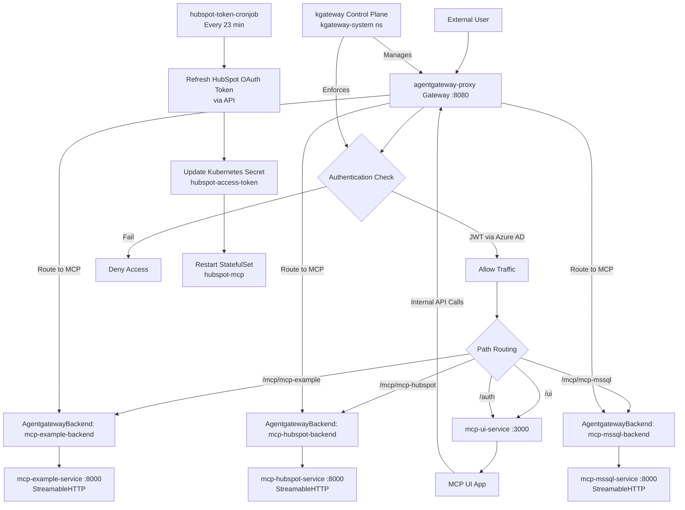

# Agent Gateway MCP Architecture Flow

## Overview

The Agent Gateway MCP architecture is a Kubernetes-based system that provides a unified entry point for Model Context Protocol (MCP) servers, featuring authentication, routing, and a web UI for interaction. It leverages the Gateway API for traffic management and supports multiple MCP servers (e.g., example, HubSpot, MSSQL) with scheduled token refresh via cronjobs.

## Custom Resource Definitions (CRDs)

The architecture relies on two sets of Custom Resource Definitions (CRDs) to extend Kubernetes functionality for advanced traffic management and MCP-specific features.

### Gateway API CRDs

- **Purpose**: The Gateway API CRDs provide a standardized set of Kubernetes APIs for traffic management, including resources like `Gateway`, `HTTPRoute`, `TCPRoute`, and others. These enable declarative configuration of ingress traffic routing, load balancing, and protocol handling.
- **Deployment**: Deployed via the `deploy-agentgateway.sh` script using `kubectl apply -f` from the official Kubernetes Gateway API repository (version v1.4.0).
- **Role in Architecture**: The `Gateway` resource (`agentgateway-proxy`) acts as the entry point for external traffic on port 8080, while `HTTPRoute` resources define routing rules for different paths (e.g., `/ui`, `/mcp/*`). This allows for flexible, scalable traffic management without relying on traditional Ingress controllers.

### Agentgateway CRDs

- **Purpose**: Agentgateway CRDs introduce custom resources tailored for MCP server integration, such as `AgentgatewayBackend` for defining backend services and `AgentgatewayPolicy` for enforcing authentication and authorization rules.
- **Deployment**: Installed via Helm chart from the Agentgateway OCI registry (`oci://cr.agentgateway.dev/charts/agentgateway-crds`, version v2.2.0-beta.4) in the `agentgateway-system` namespace.
- **Role in Architecture**: `AgentgatewayBackend` resources enable routing to MCP servers using protocols like StreamableHTTP, while `AgentgatewayPolicy` resources implement JWT authentication with Azure AD. These CRDs bridge standard Gateway API functionality with MCP-specific requirements, ensuring secure and protocol-aware traffic flow.

## Key Components

- **Control Plane**: The kgateway control plane, deployed as a Helm chart in the `kgateway-system` namespace, is responsible for managing the overall gateway infrastructure. It handles the lifecycle of Gateway and HTTPRoute resources, enforces policies, and coordinates with the proxy for traffic routing and load balancing.
- **Proxy/Gateway**: The `agentgateway-proxy` is a Gateway resource that serves as the primary ingress point, listening on port 8080. It routes incoming HTTP traffic based on path prefixes defined in attached HTTPRoute resources, directing requests to appropriate backends such as the UI or MCP servers.
- **Authentication**: Authentication is enforced through an `AgentgatewayPolicy` resource that implements Azure AD JWT validation. The policy verifies JWT tokens against the JWKS endpoint from `login.microsoftonline.com`, ensuring only authenticated users can access protected routes.
- **MCP Servers**: Each MCP server (e.g., `mcp-example`, `mcp-hubspot`, `mcp-mssql`) consists of a Kubernetes Deployment, Service, `AgentgatewayBackend` custom resource, and HTTPRoute. The `AgentgatewayBackend` defines the backend configuration for StreamableHTTP protocol communication on port 8000, enabling bidirectional streaming for MCP messages.
- **UI**: The `mcp-ui` application is deployed as a web service on port 3000, providing a user-friendly interface for interacting with MCP servers. It is accessible via the `/ui` path, which is rewritten to `/` for the service, and includes authentication endpoints at `/auth`.
- **Cronjob**: The `hubspot-token-cronjob` is a Kubernetes CronJob that runs every 23 minutes to refresh OAuth access tokens for the HubSpot MCP server. It retrieves new tokens using stored credentials, updates the `hubspot-access-token` secret, and triggers a rollout restart of the `hubspot-mcp` StatefulSet to apply the updated token.

## Deployment Process and Automation

The deployment of the Agent Gateway MCP architecture is fully automated through the `deploy-agentgateway.sh` script, which handles prerequisites, installations, and resource deployments in a sequential manner.

### Prerequisites

- A running Kubernetes cluster with appropriate permissions.
- Environment variables for Azure AD integration: `AZURE_TENANT_ID` and `AZURE_CLIENT_ID` (optional but recommended for authentication).

### Tool Installations

- **kubectl**: The script checks for and installs the latest stable version of kubectl if not present, ensuring cluster interaction capabilities.
- **Helm**: Installs Helm 3 if missing, required for deploying charts like the MSSQL server and Agentgateway components.

### Namespace Management

- Creates the `agentgateway-system` namespace if it does not exist, serving as the primary namespace for all Agentgateway-related resources.

### Helm Deployments

- **MSSQL Server**: Adds the `simcube` Helm repository and installs the `mssqlserver-2022` chart (version 1.2.3), deploying a SQL Server instance for the MCP-MSSQL server. Waits for pods to be ready and retrieves the auto-generated password from the secret.
- **Gateway API CRDs**: Applies the standard Gateway API CRDs (version v1.4.0) to enable Gateway and HTTPRoute resources.
- **Agentgateway CRDs**: Deploys Agentgateway-specific CRDs (version v2.2.0-beta.4) via Helm, introducing `AgentgatewayBackend` and `AgentgatewayPolicy` resources.
- **Agentgateway Control Plane**: Installs the core Agentgateway Helm chart, setting up the control plane in the `agentgateway-system` namespace.

### Resource Applications

- **Proxy Creation**: Applies the `mcp-gateway-proxy.yml` to create the `agentgateway-proxy` Gateway resource.
- **MCP Servers**: Deploys each MCP server by applying their respective YAML files: deployment, backend, and HTTP route for `mcp-example`, `mcp-hubspot`, and `mcp-mssql`.
- **Cronjob**: Applies `cronjob-deployment.yml` to set up the token refresh cronjob.
- **Authentication Policy**: If Azure credentials are provided, applies `agent-gateway-policy.yml` to create the Azure AD authentication policy.
- **UI Deployment**: Applies `mcp-ui-deployment.yml` and `mcp-ui-http-route.yml` to deploy the UI application and its routing.

### Waiting and Verification

- Waits for all pods in the `agentgateway-system` namespace to be ready after key deployments.
- Verifies the status of deployments, including the proxy and MCP servers.

### Port Forwarding

- Sets up port forwarding for the `mcp-ui-service` to `localhost:4000` using a detached screen session for persistent access to the UI.
- Installs `screen` if not present to manage the background port-forward process.

This automated process ensures a consistent, repeatable deployment of the entire architecture with minimal manual intervention.

## Traffic Flow and Component Relationships

## Detailed Flow Explanation

1. **Ingress Traffic**:
   - External requests enter via the `agentgateway-proxy` Gateway on port 8080, enabled by Gateway API CRDs deployed via the automation script.
   - The Gateway API routes traffic based on HTTPRoute rules attached to the proxy, providing declarative path-based routing.

2. **Authentication**:
   - The `azure-mcp-authn-policy` (AgentgatewayPolicy, provided by Agentgateway CRDs) enforces strict JWT authentication using Azure AD.
   - Tokens are validated against JWKS from `login.microsoftonline.com`.
   - Authenticated traffic proceeds; unauthenticated requests are denied.

3. **Routing**:
   - **UI Traffic**: Paths `/ui` and `/auth` route to `mcp-ui-service` on port 3000. The `/ui` path is rewritten to `/` for the service.
   - **MCP Traffic**: Paths like `/mcp/mcp-example` route through `AgentgatewayBackend` resources (from Agentgateway CRDs) to respective MCP server services on port 8000 using StreamableHTTP protocol. HTTPRoute resources (from Gateway API CRDs) define the path matching and routing logic.

4. **MCP Protocol Interactions**:
   - MCP servers communicate via the StreamableHTTP protocol, enabling bidirectional streaming for MCP messages.
   - The UI application interacts with MCP servers by making internal HTTP requests to the gateway (e.g., to `/mcp/*` paths), which are then routed to the appropriate backends.

5. **Cronjob Operations**:
   - The cronjob runs every 23 minutes to refresh HubSpot access tokens using stored credentials.
   - It updates the `hubspot-access-token` secret and triggers a rollout restart of the `hubspot-mcp` StatefulSet to pick up the new token.

6. **Component Relationships**:
   - All components (except control plane) reside in the `agentgateway-system` namespace, created and managed by the deployment script.
   - The control plane in `kgateway-system` oversees gateway operations and policy enforcement.
   - MCP servers are independently deployable, each with their own deployment, service, backend, and route configurations, applied sequentially by the automation script.
   - The entire architecture is deployed automatically via `deploy-agentgateway.sh`, which installs CRDs first, then Helm charts, and finally applies Kubernetes manifests in the correct order.

This architecture ensures secure, scalable access to multiple MCP servers through a single gateway, with automated token management, CRD-enabled extensibility, and a user-friendly web interface.